## Replication study on Streaming Machine Learning algorithms for Class Imbalance and Concept Drift

# Introduction

Data Stream analysis is a rising field of Machine Learning where the data to be analyzed are coming from an infinite flow.
This is introducing new challenges regarding the use of a finite number of resourses and the need to be at least as fast as the this flow.
The difficulty on analyzind Data streams doesn't stop here. They usually have a very skewed class distribution known as **Class Imbalance**, and we need to be alert for **Concept Drifts**, indeed their distribution can change unpredictively over time.

# State of Art

The algorithms I have tested are Online Bagging techniques, CSMOTE, Rebalance Stream and Ensamble of Online sequential extreme learning machine. 

## Online Bagging

The idea of this class of algorithms is to make an ensamble of base learners where for each one of them the classes are balanced, choosing how many times the learners will train with the new sample based its class. This methods continuosly learn the class imbalance status in data streams and the sampling parameters for the learners adaptively.

### OOB and UOB
The class balancing can be done in two ways: Undesampling the majority class examples or Oversampling the minority class examples. 
In the original Oversampling Online Bagging and Undersampling Online Bagging there is a parameter "w(k)" for each class that denote the size percentage of class k and a parameter "R(k)" that denotes the accuracy of the model on class k and it can help the online learner to decide which class needs more attention.

OOB will update each learner 1 time if the sample is from a majority class, otherwise the number of updates will be choose from a Poisson distribution with lambda 1/w(k).

UOB will update each learner 1 time if the sample is from a minority class, otherwise the number of updates will be choose from a Poisson distribution with lambda 1 - w(k)  

### Improved OOB and UOB

This algorithms come from a more recente study of OOB and UOB claming that the strategy of setting lambda is not consistent with the imbalance degree, and varies with the number of classes.
In this version of Online Bagging lambda is determined by the size ratio between classes. Considering the positive class (+) the minority and the megative class (-) the majority, improved OOB will set lambda(+) = w(-)/w(+) and lambda(-) = 1, improved UOB instead will set lambda(+) = 1 and lambda(-) = w(+)/w(-)

### Weighted Ensambles

The same paper which proposed the improved versions also presented two ensamble strategies to combine the strength of OOB and UOB.
This ensambles need a new parameter, called Smoothed Recall. It is a moving avarage of the recall of each class to smooth out it's short-term fluctuations.
In order to weight the predictions of the OOB and UOB their G-mean values are computed using their Smoothed Recalls.
WEOB1 use the normalized G-mean values of OOB and UOB as their weights to compute a weighted sum of their predictions, WEOB2 instead compares the G-mean values and use only the prediction of the model with the higher one.

## CSMOTE
Synthetic Minority Oversampling Technique (SMOTE) is one of the most used oversampling techniquesto solve the imbalance problem. It consinst on generating synthetic samples from a linear interpolation between a minority class sample and one of his neighbour selected randomly from his k-nearest neighbour.

CSMOTE keeps the minority samples in a window managed by ADWIN. ADaptive sliding WINdow (ADWIN) is a chenge detector and estimation algorithm based on the exponantial histogram. It keeps a variable lenght window consistent with the hypothesis "there has been no change in the avarage value inside the window" by checking chenge at many scales simultaneously.

When the minority sample ratio is less than a certain threshold, an online SMOTE version is applied until the minority sample ratio is greater or equal than the threshold. The model is then trained with the new samples generated.

## RebalanceStream

RebelanceStream aims at dealing with both concpet drift and class imbalance using ADWIN and multiple models. 
When new samples arrives, they are added to a batch and one base learner is trained.

When ADWIN detects a warning for a concept drift, the algorithm start collecting samples in a new batch called resetBatch. When the ADWIN detect the change 3 new learners are trained, one only with the resetBatch, one with the resetBatch balanced with SMOTE and one with the original Batch rebalanced with SMOTE. The one with the better k-statistic is chosen to be the new learner and both the Batch and the resetBatch are emptied.

## Hoeffding Adaptive Tree
All the above algorithms have been tested using 10 Hoeffding Adaptive Tree (HAT) as base learner
The Hoeffding Tree is a tree based streaming classification algorithm that use the Hoeffding bound to decide if a leaf need to be splitted.
The Adaptive version uses an ADWIN to detect change and start building new trees. As soon as there is evidence that the new tree is more accurate, the old tree is replaced.

## ESOS-ELM

Extreme learning machine (ELM) provides a single step least square estimatation method for training single hidden layer feed forward network. The input weights and biases connecting input layer to the hidden layer (hidden node parameters) are assigned randomly and the weights connecting the hidden layer and the output layer (output weights) are determined analytically. Compared to the traditional iterative gradient decent methods such as back propagation algorithm, training is extremely fast in ELM and it just requires a matrix inversion.

The online version of this algorithm is called OS-ELM and it updates the ELM with data chunks. Recently, weighted extreme learning machine (WELM) has been proposed as a cost-sensitive algorithm for class imbalance learning and the corresponding online version WOS-ELM. However, WOS-ELM was proposed only for sta- tionary environments and may not be appropriate for concept drift learning. 

Ensemble of Subset Online Sequential Extreme Learning Machine (ESOS-ELM), has been proposed for class imbalance learning from a concept-drifting data stream. In ESOS-ELM, a minority class sample is processed by ‘m’ OS-ELM classifiers (‘m’ should be at least the imbalance ratio, in our case is 10) while a majority class sample is processed by a single classifier. The majority class samples are processed in a round robin fashion, i.e., the first majority class sample is processed by the first classifier, the second sample by the second classifier and so on. In this way, classifiers in the ensemble are trained with balanced subsets from the original imbalanced dataset. Furthermore the WELM is used as a batch classifier for recurrent concepts.

I collected all the paper that i am referring to [here](papers/) 

# Datastreams

I generated 9 different types of drift forking this [generator](https://github.com/dabrze/imbalanced-stream-generator) and building a script to aumatically generate the data streams files. You can find my version of the generator and the script [here](datasets/Generator) 
Datastreams specifics:
* 100 thousands examples each
* 4 imbalance rates: 1-9 / 2-8 / 3-7 / 4-6
* 3 different drift speeds: sudden at 50000th sample, incremental starting at 45000th sample and ending at 55000th sample, recurrent starting at 45000th sample, going until the 50000th and coming back at the original distribution at the 55000th sample.
* 9 drifts:

| Name                             | Drift phase                                                              |
| :------------------------------: | :----------------------------------------------------------------------: |
| appearing-clusters               | 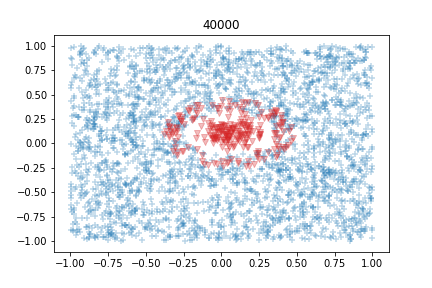    |
| splitting-clusters               | 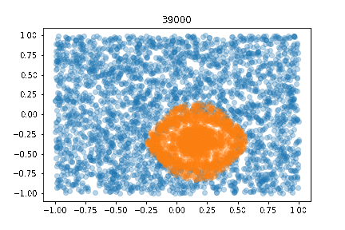               |
| shapeshift                       | 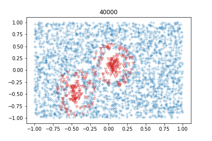            |
| clusters-movement                | 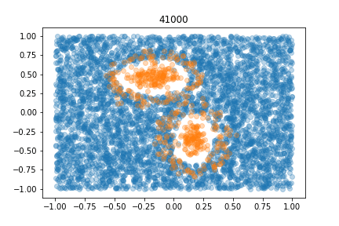     |
| disappearing-minority            | 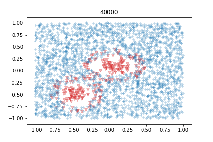 |
| appearing-minority               | 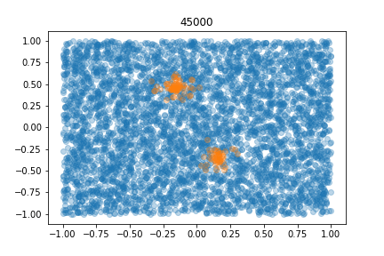         |
| minority-share                   | 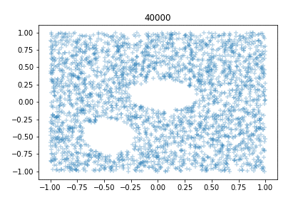        |
| jitter                           | 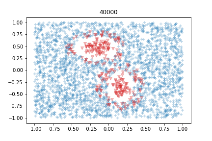                |
| borderline                       | 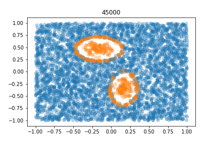            |

I also tested the algorithms on the Sea and Sine [datasets](datasets/SeaSine) generated with the corresponding moa generators.
SINE has two relevant attributes. Each attributes has values uniformly distributed in [0; 1]. In the first context all points below the curve y = sin(x) are classified as positive.
SEA concepts functions are described in the paper "A streaming ensemble algorithm (SEA) for large-scale classification".

Each one in the following versions:
* 2 types of drift: sudden, incremental
* 4 imbalance rates: 1-9 / 2-8 / 3-7 / 4-6

I analyzed 3 real imbalanced datasets: Elec, PAKDD, KDDCup:

Elec comes from Electricity and it is another widely used dataset described by M. Harries and analysed by Gama. This data was collected from the Australian New South Wales Electricity Market. In this market, prices are not fixed and are affected by demand and supply of the market. They are set every five minutes. The ELEC dataset contains 45312 instances. The class label identifies the change of the price relative to a moving average of the last 24 hours.
Instances: 45312
Negative class %: 57%
Positive class %: 42%

The PAKDD 2009 competition focuses on the problem of credit risk assessment. 
Instances: 50000
Negative class %: 80%
Positive class %: 20%

KDDCup 1999 dataset which is about cumputer network intrusion detection. The task for the classifier learning contest organized in conjunction with the KDD'99 conference was to learn a predictive model (i.e. a classifier) capable of distinguishing between legitimate and illegitimate connections in a computer network.
Instances: 494021
Negative class %: 80%
Positive class %: 20%

you can find them [here](datasets/Real). 

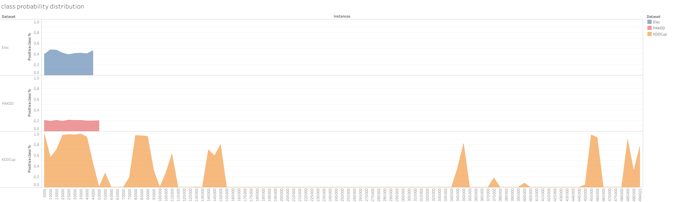

# Algorithms implementation

The moa algorithms implementation can be found [here](algorithms_java).
In this repository I uploaded only the corresponding java classes, for the complete version of moa refer to this [moa fork](https://github.com/08volt/moa "moa fork")).

# Experiments

I run 10 experiments for each Algorithm on each Dataset using an AWS virtual machine.
[Here](tests) you can find the code to build the bash to run the experiments and the code to build the query to extract the results from influx.

# Results on Artificial Datastreams

F1 score:
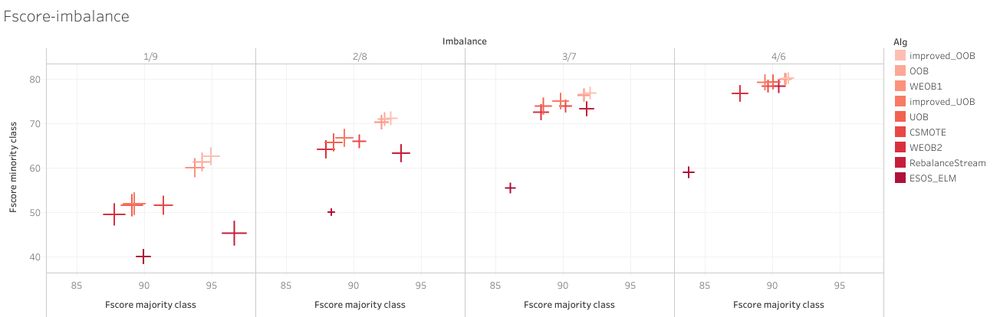

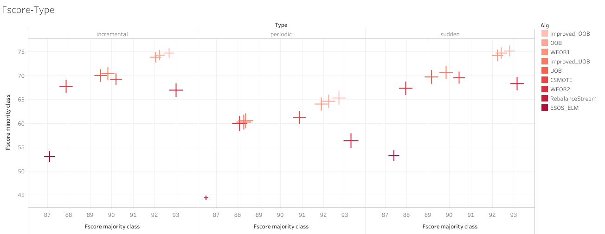

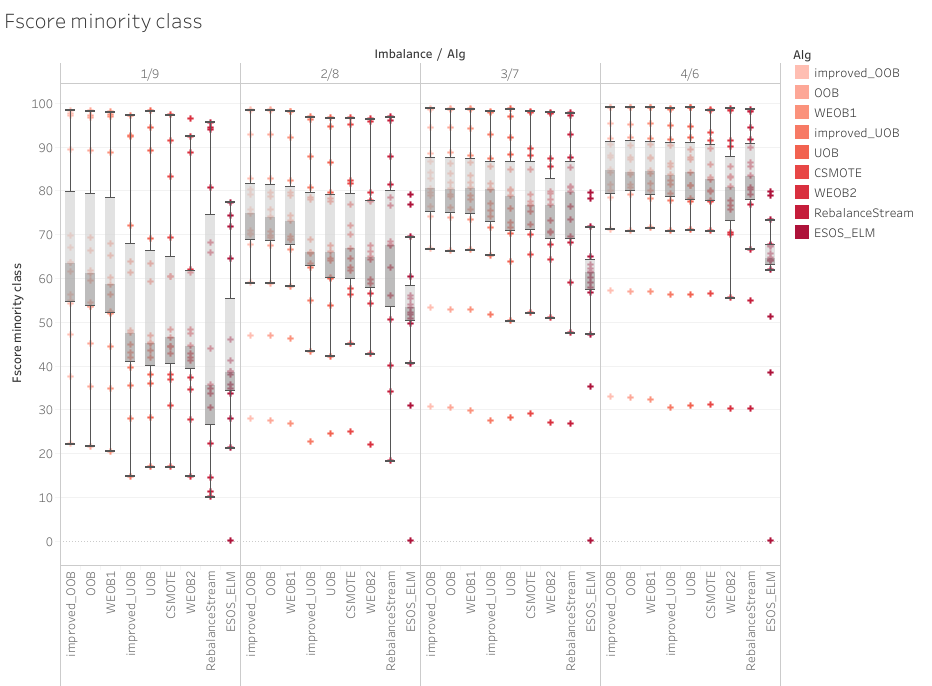

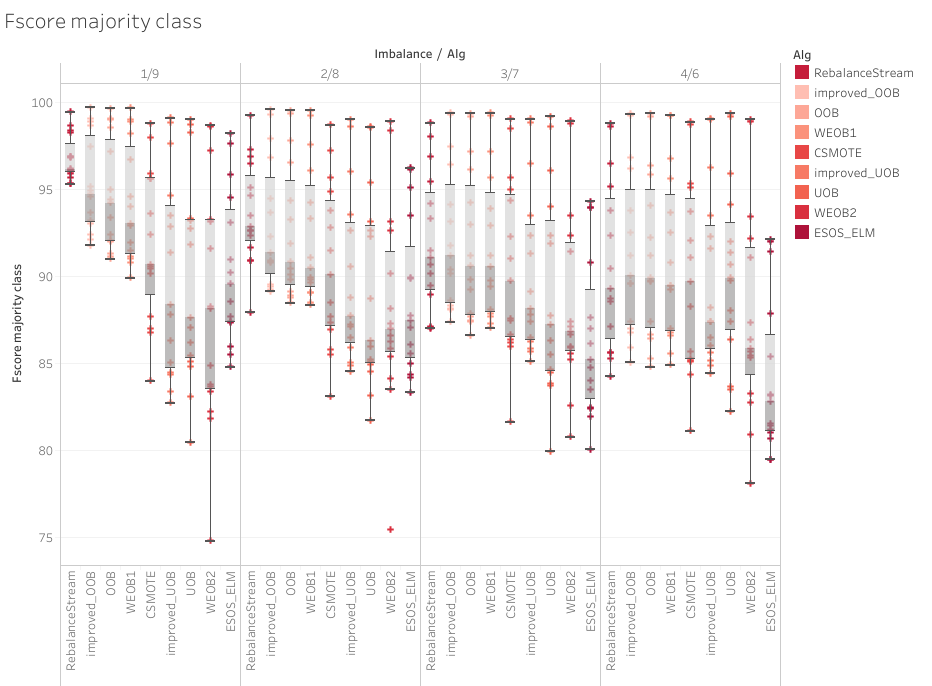

Recall:

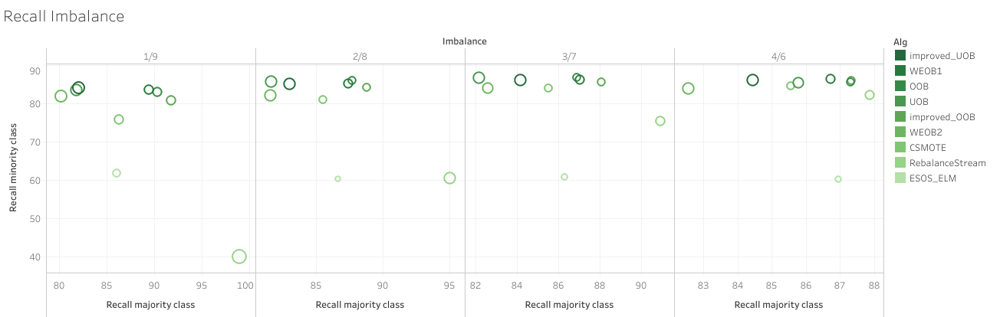

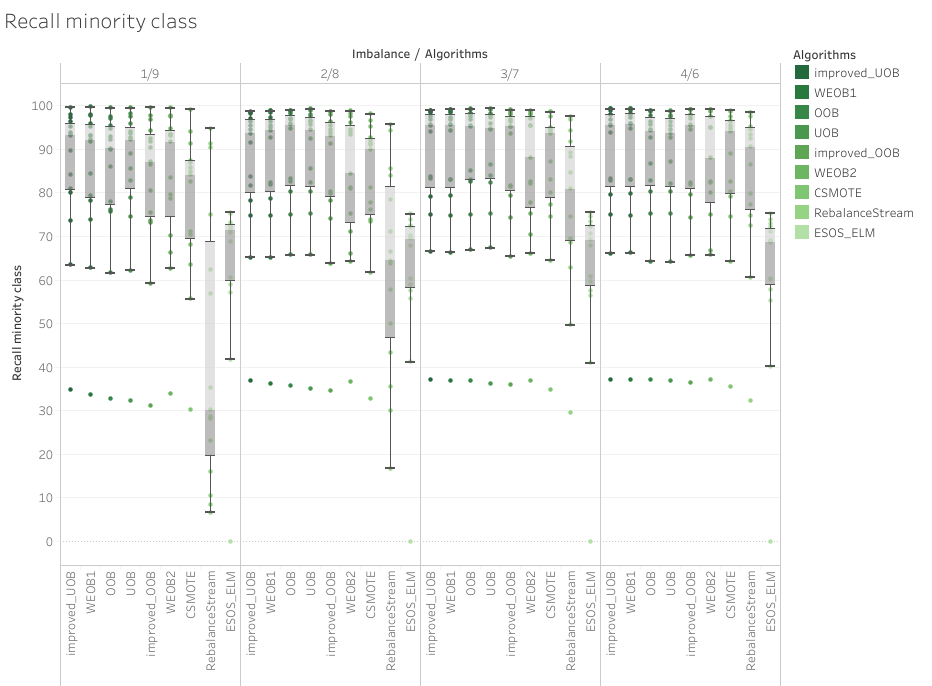

Time and Memory:

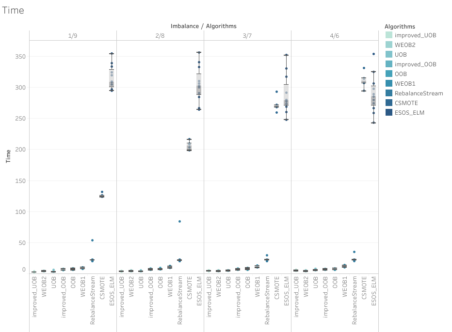
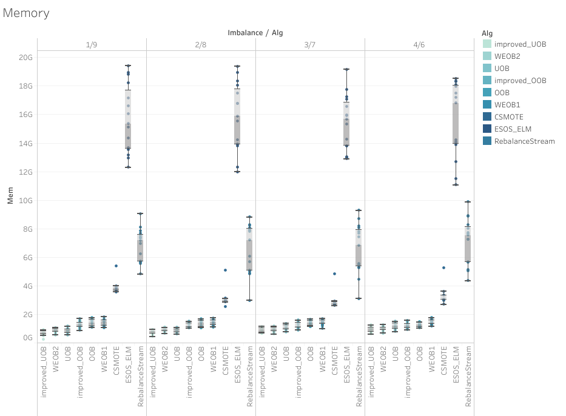
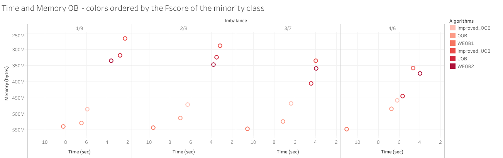

# Results on Real Datasets

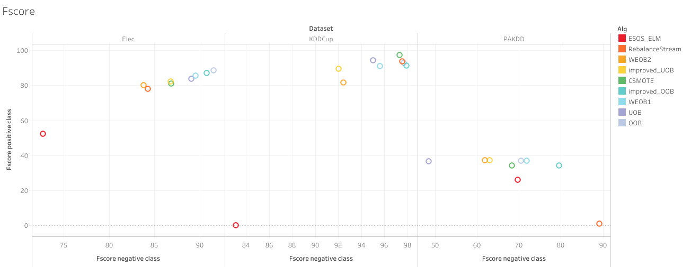
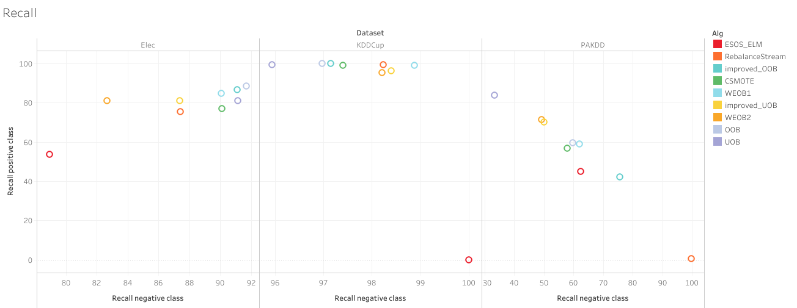
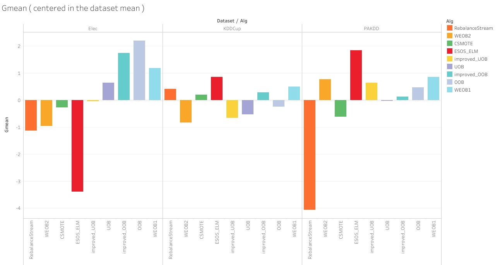
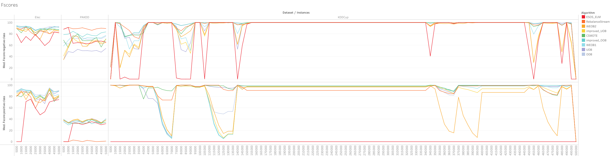
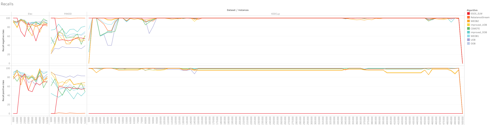
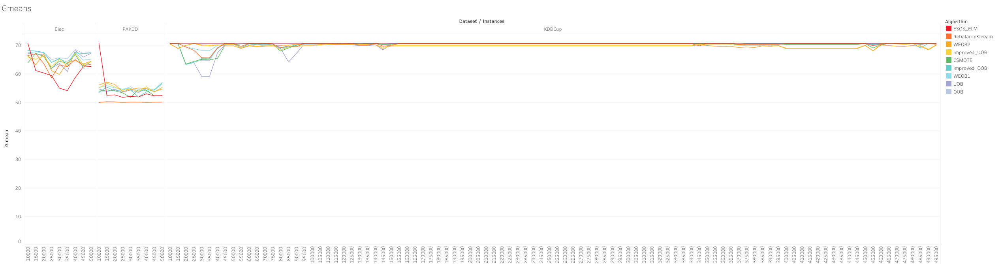

