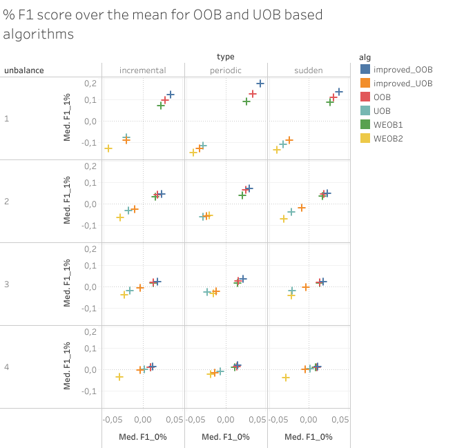
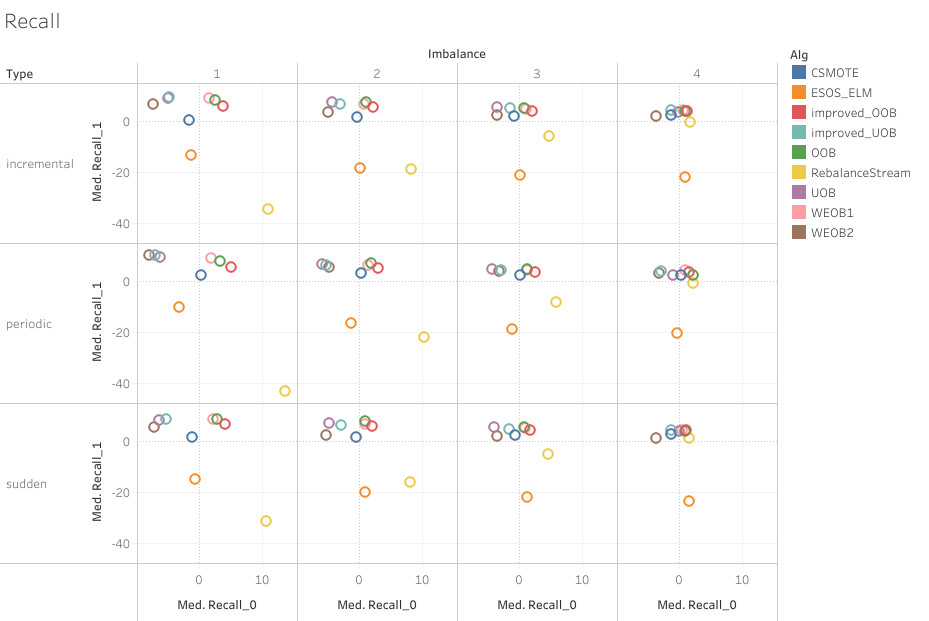
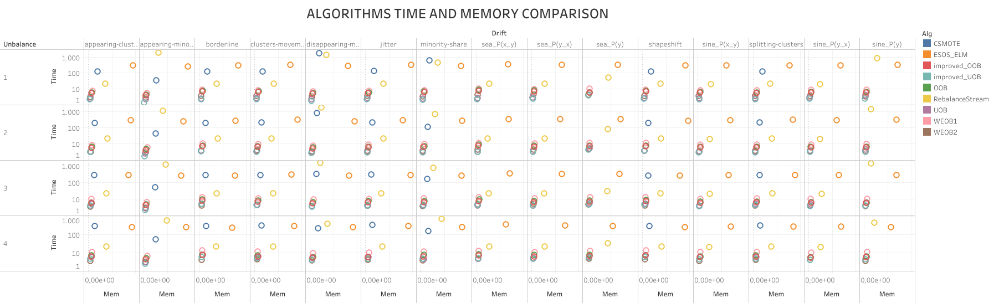

### Replication study on Stream Machine Learning algorithms for Class Imbalance and Concept Drift

# Introduction

Data Stream analysis is a rising field of Machine Learning where the data to be analyzed are coming from an infinite flow.
This is introducing new challenges regarding the use of a finite number of resourses and the need to be at least as fast as the this flow.
The difficulty on analyzind Data streams doesn't stop here. They usually have a very skewed class distribution known as **Class Imbalance**, and we need to be alert for **Concept Drifts**, indeed their distribution can change unpredictively over time.

# State of Art

The algorithms I have tested are Online Bagging techniques, CSMOTE, Rebalance Stream and Ensamble of Online sequential extreme learning machine. 

## Online Bagging

The idea of this class of algorithms is to make an ensamble of base learners where for each one of them the classes are balanced, choosing how many times the learners will train with the new sample based its class. This methods continuosly learn the class imbalance status in data streams and the sampling parameters for the learners adaptively.

### OOB and UOB
The class balancing can be done in two ways: Undesampling the majority class examples or Oversampling the minority class examples. 
In the original Oversampling Online Bagging and Undersampling Online Bagging there is a parameter "w(k)" for each class that denote the size percentage of class k and a parameter "R(k)" that denotes the accuracy of the model on class k and it can help the online learner to decide which class needs more attention.

OOB will update each learner 1 time if the sample is from a majority class, otherwise the number of updates will be choose from a Poisson distribution with lambda 1/w(k).

UOB will update each learner 1 time if the sample is from a minority class, otherwise the number of updates will be choose from a Poisson distribution with lambda 1 - w(k)  

### Improved OOB and UOB

This algorithms come from a more recente study of OOB and UOB claming that the strategy of setting lambda is not consistent with the imbalance degree, and varies with the number of classes.
In this version of Online Bagging lambda is determined by the size ratio between classes. Considering the positive class + the minority and the megative class - the majority, improved OOB will set lambda(+) = w(-)/w(+) and lambda(-) = 1, improved UOB instead will set lambda(+) = 1 and lambda(-) = w(+)/w(-)

### Weighted Ensambles

The same paper which proposed the improved versions also presented two ensamble strategies to combine the strength of OOB and UOB.
This ensambles need a new parameter, called Smoothed Recall. It is a moving avarage of the recall of each class to smooth out it's short-term fluctuations.
In order to weight the predictions of the OOB and UOB their G-mean values are computed using their Smoothed Recalls.
WEOB1 use the normalized G-mean values of OOB and UOB as their weights to compute a weighted sum of their predictions, WEOB2 instead compares the G-mean values and use only the prediction of the model with the higher one.

## CSMOTE

## RebalanceStream

## ESOS-ELM

I collected all the paper that i am referring to [here](papers/) 

# Dataset generation

I analyzed 3 types of drift with 4 imbalance rates for each Sea and Sine [datasets](datasets/SeaSine).
I generated 9 type with this data [genarator](datasets/Generator) each with 4 imbalance rates.
I also analyzed 3 real dataset you can find [here](datasets/Real). 

# Algorithms implementation

I implemented the algorithms in moa [here](algorithms code).
Here I uploaded only the corresponding java classes, for the complete moa fork refer to this [moa fork](https://github.com/08volt/moa "moa fork")).

# Experiments
I run 10 experiments for each Algorithm on each Dataset using an AWS virtual machine.
[Here](tests) you can find the code to build the bash to run the experiments and the code to build the query to extract the results from influx.

# Results

F1 score:

Recall:

Time and Memory:

